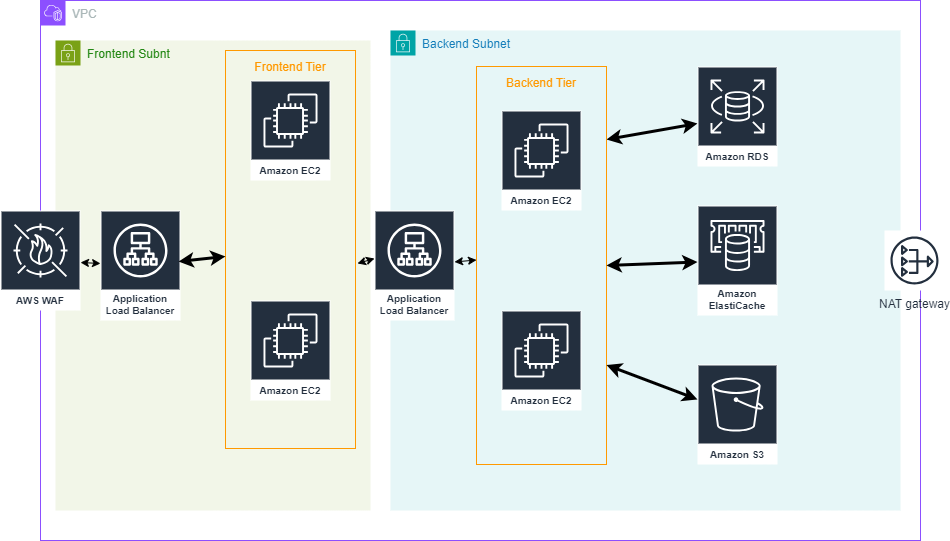

# AWS Infrastructure as Code (IaC) Template

## Overview

This repository contains an AWS Infrastructure as Code (IaC) template designed to set up a scalable and cost-optimized architecture. The template provisions the following resources:
- Virtual Private Cloud (VPC) with frontend and backend subnets
- Amazon EC2 instances for frontend and backend tiers
- Application Load Balancers for both tiers
- Amazon RDS for database management
- Amazon ElastiCache for caching
- Amazon S3 for storage
- AWS WAF for web application security

The included Terraform files define the necessary AWS resources, and the diagram and cost optimization report provide additional context on the architecture and cost-saving strategies.

## Architecture Diagram



## Cost Optimization Report

For details on optimizing resource usage and costs without compromising security and scalability, refer to the [Cost Optimization Report](NXT-A2-Cost%20optimization-report.docx).

## Files

- `main.tf.lua`: Main Terraform configuration file.
- `outputs.tf.txt`: Output variables configuration.
- `variables.tf.txt`: Input variables configuration.
- `terraform.tfvars.txt`: Terraform variables file.

## Prerequisites

- Terraform installed on your local machine.
- AWS CLI configured with appropriate credentials.
- An AWS account with permissions to create the necessary resources.

## Usage

1. **Clone the repository**:
   ```sh
   git clone <repository_url>
   cd <repository_name>
   ```

2. **Initialize Terraform**:
   ```sh
   terraform init
   ```

3. **Plan the infrastructure**:
   ```sh
   terraform plan
   ```

4. **Apply the configuration**:
   ```sh
   terraform apply
   ```

5. **Verify the outputs**:
   After the apply command completes, Terraform will output the IDs and DNS names of the created resources.

## Variables

The following variables are defined in the `terraform.tfvars.txt` file:

\`\`\`hcl
region                = "us-west-2"
vpc_cidr              = "10.0.0.0/16"
frontend_subnet_cidr  = "10.0.1.0/24"
backend_subnet_cidr   = "10.0.2.0/24"
\`\`\`

These variables can be modified to fit your requirements.

## Outputs

The following outputs are defined in the `outputs.tf.txt` file:

\`\`\`hcl
output "vpc_id" {
  value = aws_vpc.main.id
}

output "frontend_subnet_id" {
  value = aws_subnet.frontend.id
}

output "backend_subnet_id" {
  value = aws_subnet.backend.id
}

output "frontend_elb_dns" {
  value = aws_elb.frontend_elb.dns_name
}

output "backend_elb_dns" {
  value = aws_elb.backend_elb.dns_name
}

output "rds_endpoint" {
  value = aws_rds_instance.main.endpoint
}

output "s3_bucket_name" {
  value = aws_s3_bucket.main.bucket
}
\`\`\`

These outputs provide the IDs and DNS names of the created resources.

## Cost Optimization Strategies

For strategies on optimizing costs while maintaining security and scalability, refer to the [Cost Optimization Report](NXT-A2-Cost%20optimization-report.docx).

## License

This project is licensed under the MIT License.
